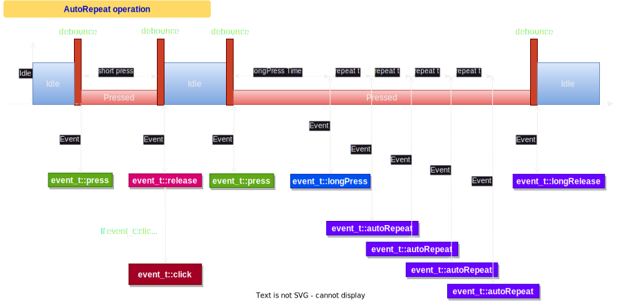
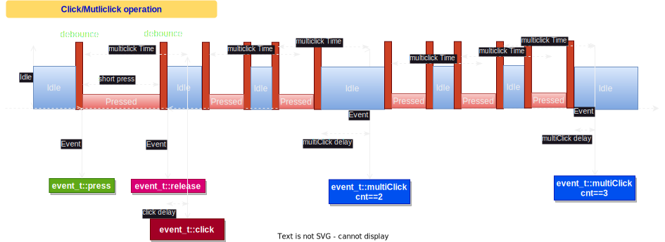

# ESPAsyncButton

__[EXAMPLES](/examples/) |__ 

Event-based asynchronous button library for the ESP32 arduino/IDF

This project has started as a fork of [rwmingis/InterruptButton](https://github.com/rwmingis/InterruptButton) - a really nice lib for ESP32 interrupt based buttons. But then I reworked it down to scratch to implement a set of classes for versatile button management for ESP32 family chips. It uses event-driven approach to register, transfer an handle button events. Utilizing RTOS features and HW timers event handling is fully asynchronous and decoupled from gpio ISRs. It allows to build flexible event-drivent derivatives for asynchronous, thread-aware projects.

## Features:

 * GPIO-based momentary buttons with/without debouncing
 * Interrupts + HW timers are used to register button press/release and generate events
 * button event propagation and handling via [ESP Event loop](https://docs.espressif.com/projects/esp-idf/en/stable/esp32/api-reference/system/esp_event.html)
 * gpio's ISR and event processing are decoupled from each other, i.e. it is possible to handle multiple gpios from a single callback-handler
 * selectable button behavior
    - default is `press`/`release`
    - `longPress`, `longRelease` events could be enabled on button hold
    -   `autorepeat` events while button is on hold
    -   `click`, `multiclick` events for any number of consecutive short clicks counting
 * policy-based class templates to easy integrate user-defined event handler policies

## Operation states

Depending on enabled event types button generates events when switching between states. Following diagrams could help to understand it better.

### Short/Long press events

By default only two events are enabled for GeneralButton object:
 - `ESPButton::event_t::press` - generated each time button is presses
 - `ESPButton::event_t::release` - generated each time button is released

If `LongPress`/`LongRelease` events are enabled, then each time button is pressed a timer is started with timeout `TimeOuts::longPress` ms. If this timer expires before button is released, then an event `ESPButton::event_t::longPress` is generated. Then, if longPress was triggered, on button release `ESPButton::event_t::longRelease` event will be generated instead of `ESPButton::event_t::release`.

Timeline events diagram:

### Autorepeat event

Autorepeat event generation might be enabled to generate events periodically while button is kept in pressed state. I.e. to repeat some action like if the button was continously pressed and released. This could be used for scrolling, step-by-step increments, etc...

Timeline events diagram:

### Click/MultiClick events

Click/Multiclick events are enabled disabled independetly. `Click` is just a short press/release and generated on button release. `Longpress` does not generate `Click` event. `MulttiClicks` could be enabled if you need to differentiate events like 2 or more consecutive key press/release counts.
Once single click is complete, button waits for `TimeOuts::multiClick` ms, if no more consecutive clicks where performed then multiclick event is generated with additional counter value. Any number of consecutive clicks could be executed.

Timeline events diagram:

#### Thanks
Thanks to [R. Mingis](https://github.com/rwmingis) for his original lib and inspiration for this project.

